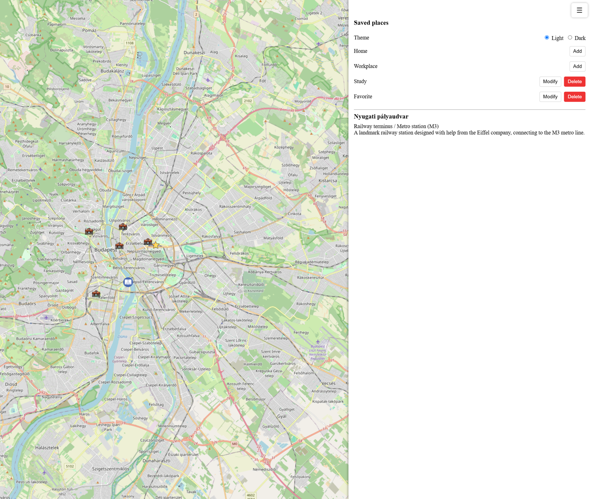
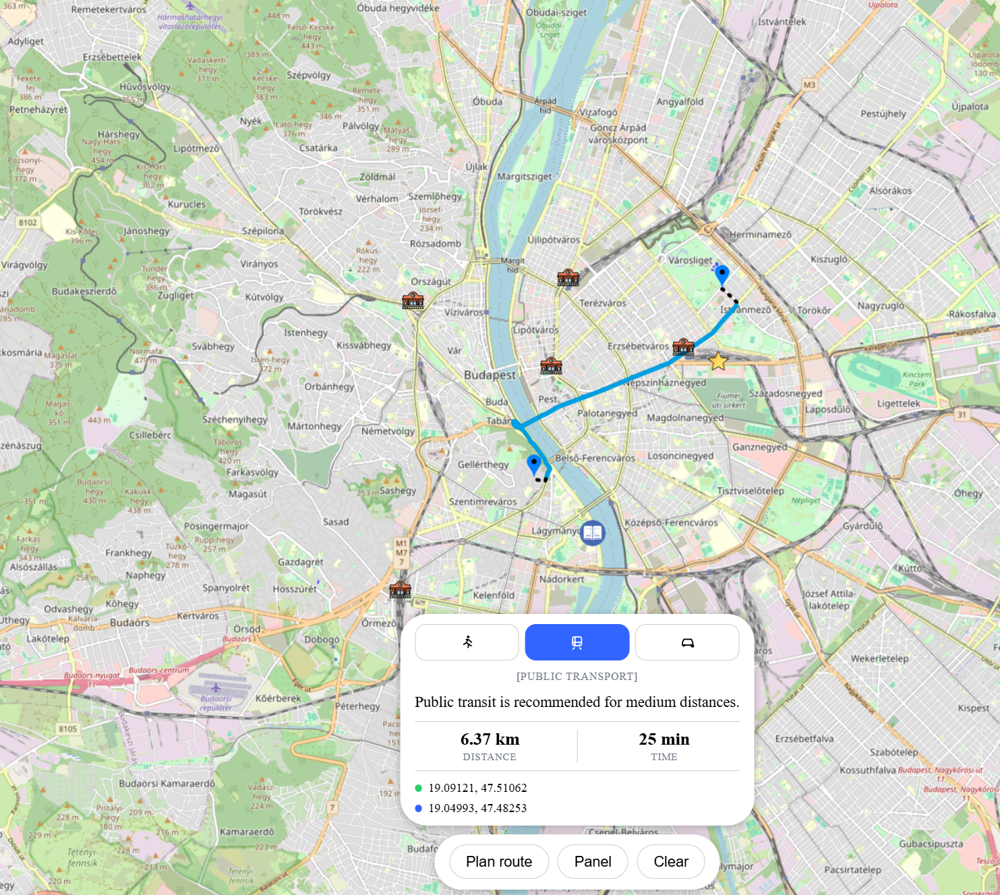
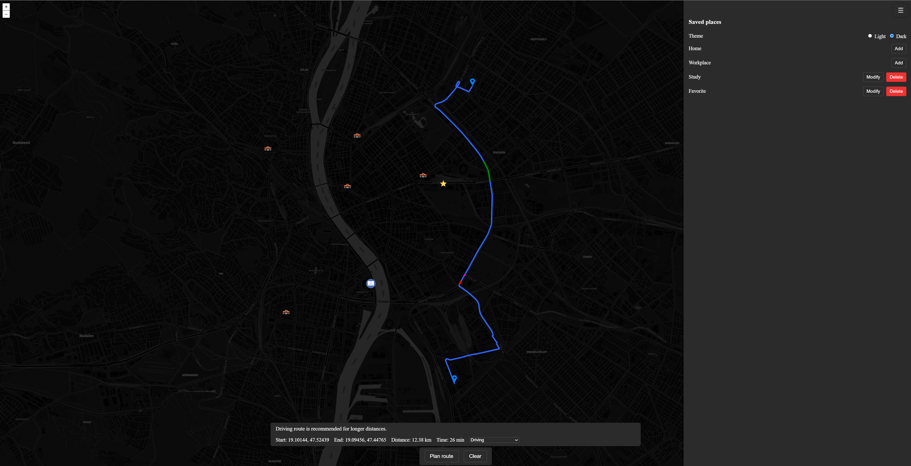

# Budapest Route Planner

A browser based map application for planning routes around Budapest. Pick a start and end point, get a walking, cycling, or driving route (with live traffic on driving routes), save personal locations, and explore key BKK public transport stations.

## Technologies

- [OpenLayers](https://openlayers.org/): interactive map rendering
- [Vite](https://vitejs.dev/): dev server and build tool
- [OSRM](http://project-osrm.org/): inital distance estimation
- [TomTom Routing API](https://developer.tomtom.com/routing-api): driving routes with live traffic
- [BKK futár API](https://opendata.bkk.hu/keys): public transit and walking routes
- Browser Geolocation API shows the user's current position
- Browser `localStorage` persists saved locations and theme choice

## Installation

```bash
git clone <repository-url>
cd <project-folder>
npm install
```

## Running the project

Driving routes require a free TomTom API key and walking/transit routes require a BKK futár key.

1. Create an account at [developer.tomtom.com](https://developer.tomtom.com) & [opendata.bkk.hu](https://opendata.bkk.hu/keys) and generate an API key.
2. Create a `.env` file in the project root:
   ```
   VITE_TOMTOM_API_KEY=your_key_here
   VITE_BKK_API_KEY=your_key_here
   ```
3. Start the dev server:
   ```bash
   npm start
   ```
4. Open the printed local URL in your browser.

## Use cases

- **Plan a route**: click two points on the map (or any of the custom markers) and click "Plan route" to get a route with distance, travel time, and a walking/driving recommendation based on distance.
- **Choose a travel profile**: switch between walking, transit, and driving; driving routes are colored by traffic severity, transit routes are colored respective to their bkk colorings.
- **Save personal places**: mark a Home, Workplace, Study, or Favorite location from the side panel; they're saved automatically and reloaded on your next visit.
- **Browse BKK stations**: right-click a station marker to see its name, type, and description in the side panel.
- **Switch theme**: toggle between light and dark map and UI, saved automatically.

## Known limitations

- Routing depends on the public OSRM demo server, which has no uptime guarantee and can be slow or rate limited under heavy use.
- The TomTom free tier has a limited number of requests per day; driving routes will fail once that limit is reached.
- Traffic sections often report a delay magnitude of 0 (no delay) or 4 (indeterminate) outside of real congestion, since TomTom can only report meaningful delay levels (1–3) where live traffic data is actually available.
- Transit routes only show the route, the exact line that follows the route is not shown
- Only a single start/end pair is supported — no multi-stop routes.
- Saved locations and theme are stored per-browser via `localStorage`; they don't sync across devices or browsers.
- Requires the user to grant location permission for the "current location" marker to appear.

## Demonstration screenshots

Here's how the map should look at startup, prompt to enable geolocation expected. Station and saved locations are visible.


Image showing the side panel. It contains information when right-clicking a station. Here you can change the theme, and add or delete saved locations that will be shown as markers.


Image showing a calculated route, method set to driving due to long distance.


Image showing the dark themed map and ui, and different traffic states reported by TomTom api.
